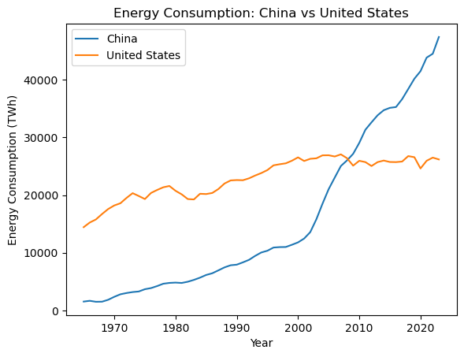

# Energy Consumption Analysis

This project analyzes global primary energy consumption trends for various countries and regions. It includes data processing, visualization, statistical analysis, and machine learning to make predictions about future energy consumption.

## Table of Contents

- [Project Overview](#project-overview)
- [Data Description](#data-description)
- [Installation](#installation)
- [Visualizations](#visualizations)
  - [Top 10 Energy Consuming Countries](#top-10-energy-consuming-countries)
  - [China vs United States Energy Consumption](#china-vs-united-states-energy-consumption)
  - [Year-on-Year Growth in China](#year-on-year-growth-in-china)
  - [Anomaly Detection in US Energy Consumption](#anomaly-detection-in-us-energy-consumption)
  - [Linear Regression Predictions](#linear-regression-predictions)
- [Dependencies](#dependencies)
- [License](#license)

## Project Overview

This project focuses on exploring and analyzing global energy consumption data using Python. Key insights include:

- Total energy consumption by countries
- Energy consumption comparison between the top energy consumers
- Year-on-year growth in energy consumption
- Detection of anomalies in energy consumption
- Predictions for future energy consumption using linear regression

## Data Description

The dataset contains the following key columns:

- **Entity**: Country, region, or continent.
- **Code**: ISO 3-letter country code.
- **Year**: The year of the data entry.
- **Primary energy consumption (TWh)**: The primary energy consumption measured in terawatt-hours.

## Installation

1. Clone this repository:
   ```bash
   git clone https://https://github.com/Sydney205/Primary-energy-consumption.git
   ```
2. Navigate to the project directory:
   ```bash
   cd energy-consumption-analysis
   ```

## Visualizations

### Country Energy Consumption Plot
- Bar plot displaying total primary energy consumption by country.
- 

### China vs United States Energy Consumption
- A line plot comparing energy consumption trends between China and the United States from 1965 onwards.
- 

### Year-on-Year Growth in China
- A line plot showing the year-on-year growth percentage in primary energy consumption for China.
- 

### Linear Regression Predictions
- Scatter plot showing the actual vs predicted values for energy consumption in the United States.
- Predictions for future energy consumption until 2050 using a linear regression model.
- 

## Dependencies

- Python 3.x
- pandas
- matplotlib
- scikit-learn

To install the dependencies, run:

```bash
pip install pandas matplotlib scikit-learn
```

## License

This project is licensed under the MIT License - see the [LICENSE](./license.md) file for details.

